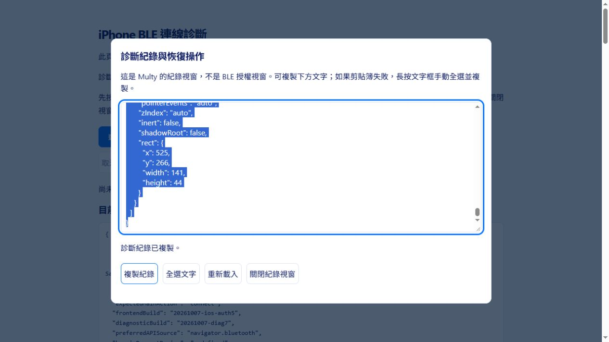

# 實作驗證紀錄

驗證日期：2026-10-06。以下結果限於本次開發環境。

| 項目 | 結果 |
|---|---|
| PlatformIO 韌體建置 | 通過；產生 ESP32-S3 韌體映像 |
| 實機燒錄 | COM4 ESP32-S3 revision v0.2；確認 16 MB Flash／8 MB PSRAM；燒錄及 Flash 雜湊驗證通過 |
| 實機 USB 串列冒煙測試 | hello、session.claim、session.ping、session.release 通過；韌體 1.0.0；裝置 Multy-1446DA020F3C |
| 記憶體占用 | RAM 45,716／327,680 bytes；程式 Flash 973,749／6,553,600 bytes |
| Node 自動測試 | 最新完整回歸 54 項通過，沒有跳過；另涵蓋掃描中立即選取、穩定點擊目標、關閉停止與 PC 傳輸回歸 |
| JavaScript 語法與變更空白檢查 | 通過 |
| HTTPS 腳本 | PowerShell 語法檢查通過；尚未實際執行 mkcert 安裝與憑證信任流程 |
| 瀏覽器介面 | 桌面六卡片、390 px 手機尺寸、主題、分頁及最大化檢查通過；未發現主控台錯誤 |

UART 介面更新：移除 Apply settings，設定變更自動套用；移除各卡片的 3.3V／GND 標籤。一般卡片 TX／RX 每列 8 bytes，最大化時每列 32 bytes；HEX 靠左、ASCII 靠右。瀏覽器已確認 TX 在兩種大小間切換保留資料，以及不可列印字元的 `.` 顯示。RX 使用相同列寬與格式函式，格式測試通過，本次未產生實機 RX 資料。I2C 三個設定與 SPI 四個設定在桌面及 390 px 手機尺寸均為同一列，沒有造成整頁水平溢出。新版自動套用流程尚未透過瀏覽器連接實機驗證。

自動測試涵蓋分段及合併訊息、UTF-8、長度限制、命令回覆配對、通知 ACK、逾時不重播、佇列優先順序、紀錄保留上限、USB 串流斷線清理、BLE 分段探測與相容模式、私有路徑限制，以及使用明確受信任測試 CA 的 HTTPS 連線。

最大化 UART 的 TX／RX HEX 每 8 bytes 加入 ` - ` 分隔符。瀏覽器已確認 32-byte TX 有三個分隔符；測試涵蓋完整 256-byte 格式、移除分隔符後的資料一致性及還原一般卡片格式。RX 使用相同分組函式。

Safari／Beacio 連線修正：在點擊時取得 Bluetooth API，不保存頁面載入時的啟動物件；保留直接使用者手勢、明列 optionalServices，並為裝置選擇與 GATT 步驟加入有界等待及狀態。測試涵蓋延遲 API、卡住的選擇視窗、同步權限錯誤與逾時後較晚完成的 GATT 清理。這些是自動化模擬驗證，尚未在使用者的 iPhone／Cloudflare 網域確認問題已解決；不將 CSP 延遲初始化判定為已證實的實機根因。

桌面垂直對齊修正：統一設定標題區與控制項高度、TX 區最小高度及上下間距。1440 px 寬度下，淺色與深色主題的 UART／I2C／SPI 設定控制項、TX 輸入區及 RX 紀錄區，其上緣座標均一致。

自動傳輸測試使用測試專用週邊模擬器；另外已完成上述實機燒錄與 USB 串列冒煙測試，測試後釋放控制權並關閉 COM4。依韌體命名規則，本機 BLE 名稱為 `Multy-ESP32S3-020F3C`，尚未執行 BLE 掃描確認。瀏覽器手機尺寸測試沒有替代實際 iPhone／Beacio 測試。硬體 UART／I2C／SPI 波形、實際 BLE 吞吐量及 iPhone 連線相容性仍待依[實機驗收清單](hardware-validation.md)驗證。

iPhone 專用 SDK 與診斷：新增官方 Beacio SDK 2.2.0 本機資源，僅 iPhone／iPad Safari 載入。PC 初始化測試確認不載入 SDK、不操作 DOM、不替換原生 Bluetooth API；桌面瀏覽器確認主頁沒有 SDK script，診斷頁顯示 `sdk: not-loaded`。本次沒有修改 transport.js、韌體或伺服器 CSP。32 項回歸測試全部通過。尚未在實際 iPhone 確認 SDK 能解決選擇視窗卡住；需在更新後的診斷頁測試並取得紀錄。

iPhone 主頁 Scan 改為獨立廣播掃描，15 秒自動停止，列出名稱包含 Multy 的裝置與 RSSI；不呼叫 requestDevice、GATT 或控制權協定。新增測試驗證原始按鈕手勢內開始掃描、廣播去重與名稱過濾、不使用選擇／GATT、手動停止、自動停止、啟動逾時後較晚取得 handle 的清理，以及 API 不支援／拒絕時不退回選擇裝置。完整 35 項回歸通過，尚待使用者 iPhone／Beacio 實機確認掃描結果。

桌面網站模式修正：線上 app.js 已確認包含 MultyScanner，首頁 Cloudflare 回應為 DYNAMIC，不能將問題直接歸因於尚未更新。原本只以版面辨識值 iphone 啟用掃描，而 Macintosh UA／MacIntel／觸控 iOS 被分類為 tablet；現以獨立 iOS 行為判斷決定掃描，保留 PC 傳輸與桌面版面辨識。新增 iOS 桌面 UA、實際 Mac、Windows 觸控 PC、Android 的測試，完整 36 項通過。入口 app 與 Beacio 模組使用版本化網址，掃描區與診斷頁顯示版本 20261007-ios-scan2；修正仍待實際手機確認。

使用者於 2026-10-07 回報：iPhone 按 Allow 後可掃描並找到 Multy-ESP32S3 裝置，確認廣播掃描通道已可用。這是使用者實機回報，不等於已確認 GATT／控制權或匯流排操作成功。

掃描後連線版本 20261007-ios-connect3：清單新增 Connect，先停止掃描，再以完整裝置名稱授權並沿用 GATT／Multy 協定；PC 的 transport.js 沒有變更。新增 5 項測試涵蓋名稱授權與原始手勢、握手／匯流排操作／釋放、授權逾時、GATT 逾時後晚到清理、名稱不符／取消及服務探索失敗。完整 41 項通過。iPhone 實機的名稱授權與連線仍待驗證，未宣稱 requestDevice 卡住已解決。

使用者隨後確認 connect3 仍卡在名稱授權，沒有選擇視窗。直接連線版本 20261007-ios-direct4 依官方 DeviceScanner／useScan／BeacioDevice 流程，保留 advertisementreceived.device 並直接連線，不再呼叫瀏覽器 requestDevice。測試驗證原始物件身分、沒有瀏覽器 chooser 呼叫、GATT 權限拒絕、GATT 逾時後晚到清理、缺少／名稱不符物件、服務探索失敗、握手操作與斷線釋放；完整 41 項通過。實機仍需確認能否通過 GATT 與服務權限，未宣稱已成功連線。

使用者實機回報 direct4 的 GATT 回覆 Device was not authorized，確認掃描許可不等於該裝置的 GATT 授權。auth5 恢復授權先於連線，依官方 platform.ts 優先使用 navigator.beacio，再 fallback 到非 stub 的 navigator.bluetooth；新增 API 來源紀錄與診斷頁比較按鈕。完整 43 項測試通過，授權逾時不會對掃描物件執行 GATT；未更改 PC 傳輸或伺服器 CSP。選擇視窗未出現的實機根因仍待 CSP／API 診斷紀錄確認，不宣稱此次修正已解決。

診斷等待版本 diag6 新增可見倒數、取消等待、重新載入與同步呼叫返回紀錄；在呼叫 API 前設定逾時計時器，不在原始使用者手勢內先 await。3 項測試驗證無回應 Promise 有界等待、取消及晚到結果隔離、同步拋錯與非同步拒絕清理；完整 46 項通過。無法以網頁計時器中止真正阻塞 JavaScript 執行緒的第三方同步呼叫，若整頁倒數也停止，仍需實機紀錄釐清。

diag7 針對使用者回報倒數結束後複製與重新載入不能操作，新增原生 showModal 診斷恢復視窗。逾時／取消自動顯示文字框，剪貼簿等待限制 1.5 秒，失敗時可全選後長按手動複製。開啟前只讀取按鈕的命中元素、dialog／iframe 與 inert／pointer-events 資訊，不移除擴充功能介面或改變授權。桌面瀏覽器確認複製成功、全選範圍覆蓋全部 6,668 字元、重新載入恢復初始頁面；完整 47 項測試通過。本次僅更改診斷頁，PC 傳輸與 CSP 未修改。實際 iPhone 恢復視窗及 Beacio 遮擋原因仍待驗證，桌面結果不能證明已解決手機的授權問題。

使用者回報 diag7 恢復視窗仍不能操作。比對 01-Test 與 beacio.com/home.js 後，diag8 新增標準服務與加入 Multy UUID 的 A/B picker-only 測試，並在逾時時自動儲存本機紀錄，新增不載入 SDK、不呼叫 BLE 的獨立紀錄頁。完整 48 項 Node 測試通過，驗證官網 API 優先順序與 UUID 為唯一參數差異，以及獨立頁資源可存取且不引用 BLE 程式。PC 主頁、transport.js、韌體與 CSP 均未改；A/B 與獨立頁效果仍待 iPhone 實測，不宣稱授權已修復。

diag8 實機 A／B 均逾時；使用者取得紀錄，證明獨立紀錄途徑提供了本次需要的證據。兩次 navigator.beacio 可用、userActivation=true、同步呼叫有返回，網頁保持 visible；各有兩筆 style-src-elem／inline 違規，開啟 Multy 恢復視窗前 body.inert=true，按鈕 disabled=false 但命中元素僅 HTML。確認樣式阻擋與背景停用，仍未證明哪個擴充功能介面造成或排除其他橋接問題。diag9 加入只限 /ble-diagnostics.html?beacioStyles=1 的內嵌 style 元素相容測試。49 項回歸通過，驗證主頁、資源、報告頁、錯誤回應與預設診斷頁仍為原 CSP，腳本不允許 unsafe-inline／unsafe-eval。主頁傳輸與韌體未改，手機新模式尚待實測。

使用者先提供的 diag9 A/B 紀錄仍是嚴格模式，styleCompatibilityRequested=false；隨後確認相容模式 A、B 均顯示選擇清單並成功返回 Multy 物件，提供樣式政策影響授權的實機證據。主頁 style10 新增應用載入前的 iOS-only URL 導向，保留其他參數與 fragment，不重複導向；主頁／index.html 明確選擇相容模式時採用與成功診斷相同的 style-src-elem 政策。51 項測試通過，涵蓋 iPhone、iOS 桌面 UA、真正 Mac、Windows 觸控、Android、iPhone 非 Safari、預設主頁 CSP 及完整傳輸回歸。PC transport.js、iOS GATT 流程與韌體未改；真正的 iPhone 主頁 GATT／握手仍待驗證。

使用者回報 style10 的主頁 Connect 沒有選擇視窗，再點顯示 no device found；線上主頁版本與樣式 CSP 已確認生效。picker11 去除 iOS 精確名稱篩選，直接重用成功診斷 B 的參數建構函式；選擇回傳後驗證同名，再沿用原 GATT 流程。52 項測試通過；測試確認原始點擊中同步呼叫、只對授權物件連線（廣播物件連線會令測試失敗），另一個 Multy／無名稱裝置均不啟動 GATT 或控制權。PC transport.js、scanner、韌體及 CSP 未改，名稱篩選是否為實際剩餘故障仍需手機 picker11 實測。

使用者確認 picker11 在 iPhone 已完成 Scan、Beacio 裝置選擇與 Multy 連線。live12 新增即時掃描 dialog，保留裝置列及按鈕 DOM，廣播只更新 RSSI／文字。54 項測試通過；新增測試在掃描仍 active 時點選（不等自動完成）、確認多次廣播後同一按鈕仍存在、先停止掃描與關閉 dialog、關閉停止與完成結果可重新查看、連線期間按鈕停用。原 IOSBleTransport、PC transport.js、韌體與政策未改；視窗在真正 iPhone 上與 Beacio 授權介面的銜接仍待 live12 實測。
