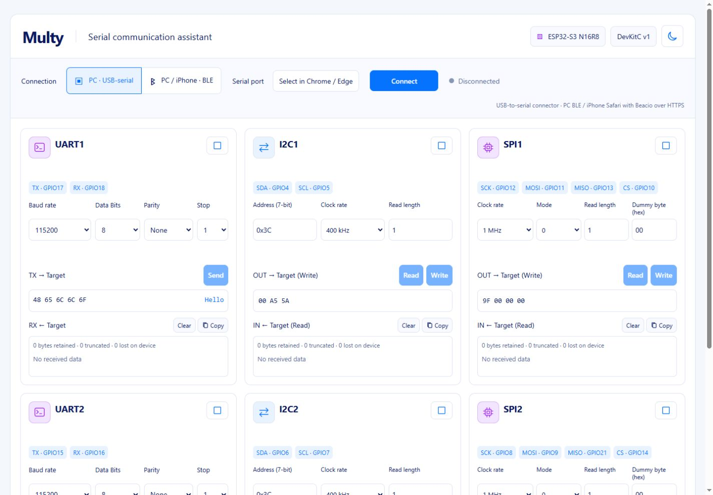
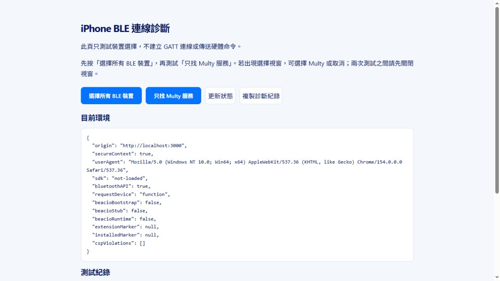

# 實作驗證紀錄

驗證日期：2026-10-06。以下結果限於本次開發環境。

| 項目 | 結果 |
|---|---|
| PlatformIO 韌體建置 | 通過；產生 ESP32-S3 韌體映像 |
| 實機燒錄 | COM4 ESP32-S3 revision v0.2；確認 16 MB Flash／8 MB PSRAM；燒錄及 Flash 雜湊驗證通過 |
| 實機 USB 串列冒煙測試 | hello、session.claim、session.ping、session.release 通過；韌體 1.0.0；裝置 Multy-1446DA020F3C |
| 記憶體占用 | RAM 45,716／327,680 bytes；程式 Flash 973,749／6,553,600 bytes |
| Node 自動測試 | 最新完整回歸 35 項通過，沒有跳過；另涵蓋 iPhone 純掃描、名稱過濾、停止／逾時清理及 PC 傳輸回歸 |
| JavaScript 語法與變更空白檢查 | 通過 |
| HTTPS 腳本 | PowerShell 語法檢查通過；尚未實際執行 mkcert 安裝與憑證信任流程 |
| 瀏覽器介面 | 桌面六卡片、390 px 手機尺寸、主題、分頁及最大化檢查通過；未發現主控台錯誤 |

UART 介面更新：移除 Apply settings，設定變更自動套用；移除各卡片的 3.3V／GND 標籤。一般卡片 TX／RX 每列 8 bytes，最大化時每列 32 bytes；HEX 靠左、ASCII 靠右。瀏覽器已確認 TX 在兩種大小間切換保留資料，以及不可列印字元的 `.` 顯示。RX 使用相同列寬與格式函式，格式測試通過，本次未產生實機 RX 資料。I2C 三個設定與 SPI 四個設定在桌面及 390 px 手機尺寸均為同一列，沒有造成整頁水平溢出。新版自動套用流程尚未透過瀏覽器連接實機驗證。

自動測試涵蓋分段及合併訊息、UTF-8、長度限制、命令回覆配對、通知 ACK、逾時不重播、佇列優先順序、紀錄保留上限、USB 串流斷線清理、BLE 分段探測與相容模式、私有路徑限制，以及使用明確受信任測試 CA 的 HTTPS 連線。

最大化 UART 的 TX／RX HEX 每 8 bytes 加入 ` - ` 分隔符。瀏覽器已確認 32-byte TX 有三個分隔符；測試涵蓋完整 256-byte 格式、移除分隔符後的資料一致性及還原一般卡片格式。RX 使用相同分組函式。

Safari／Beacio 連線修正：在點擊時取得 Bluetooth API，不保存頁面載入時的啟動物件；保留直接使用者手勢、明列 optionalServices，並為裝置選擇與 GATT 步驟加入有界等待及狀態。測試涵蓋延遲 API、卡住的選擇視窗、同步權限錯誤與逾時後較晚完成的 GATT 清理。這些是自動化模擬驗證，尚未在使用者的 iPhone／Cloudflare 網域確認問題已解決；不將 CSP 延遲初始化判定為已證實的實機根因。

桌面垂直對齊修正：統一設定標題區與控制項高度、TX 區最小高度及上下間距。1440 px 寬度下，淺色與深色主題的 UART／I2C／SPI 設定控制項、TX 輸入區及 RX 紀錄區，其上緣座標均一致。

自動傳輸測試使用測試專用週邊模擬器；另外已完成上述實機燒錄與 USB 串列冒煙測試，測試後釋放控制權並關閉 COM4。依韌體命名規則，本機 BLE 名稱為 `Multy-ESP32S3-020F3C`，尚未執行 BLE 掃描確認。瀏覽器手機尺寸測試沒有替代實際 iPhone／Beacio 測試。硬體 UART／I2C／SPI 波形、實際 BLE 吞吐量及 iPhone 連線相容性仍待依[實機驗收清單](hardware-validation.md)驗證。

iPhone 專用 SDK 與診斷：新增官方 Beacio SDK 2.2.0 本機資源，僅 iPhone／iPad Safari 載入。PC 初始化測試確認不載入 SDK、不操作 DOM、不替換原生 Bluetooth API；桌面瀏覽器確認主頁沒有 SDK script，診斷頁顯示 `sdk: not-loaded`。本次沒有修改 transport.js、韌體或伺服器 CSP。32 項回歸測試全部通過。尚未在實際 iPhone 確認 SDK 能解決選擇視窗卡住；需在更新後的診斷頁測試並取得紀錄。

iPhone 主頁 Scan 改為獨立廣播掃描，15 秒自動停止，列出名稱包含 Multy 的裝置與 RSSI；不呼叫 requestDevice、GATT 或控制權協定。新增測試驗證原始按鈕手勢內開始掃描、廣播去重與名稱過濾、不使用選擇／GATT、手動停止、自動停止、啟動逾時後較晚取得 handle 的清理，以及 API 不支援／拒絕時不退回選擇裝置。完整 35 項回歸通過，尚待使用者 iPhone／Beacio 實機確認掃描結果。
